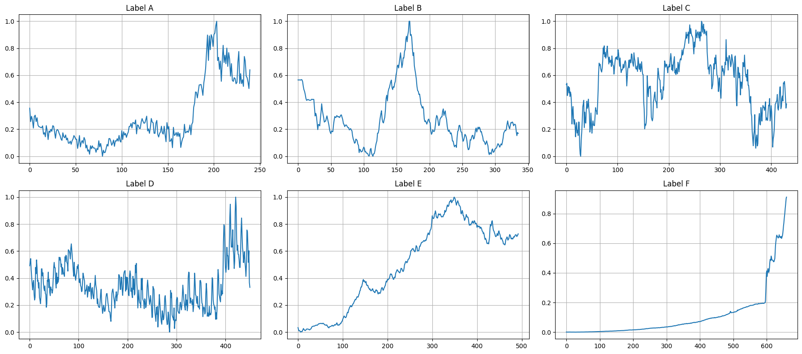

# Neural Time Series Forecasting with GRU + Conv1D

## 1) Introduction  

**Project Objective**  
The goal  is to build a **neural forecaster** for univariate time series using **recurrent and convolutional neural networks** (GRU + Conv1D).  
The model is trained to predict the **future evolution** of time series generated by different underlying processes, and must generalize well to **unseen series**.

The project is part of Homework 2 for the course **Artificial Neural Networks and Deep Learning** at Politecnico di Milano (group: *NetworkRunners*).

The work is organized in two phases:

- **Phase 1:** forecasting the next **9 timestamps**  
- **Phase 2:** forecasting the next **18 timestamps**

The goal is to design a robust architecture and training pipeline that outperforms simple baselines (e.g. trivial mean predictor) and achieves low error on a hidden test set.

---

## 2) Dataset Description  

**Source & Setup**  
The dataset consists of **48,000 univariate time series** of different lengths, normalized in value.  
Each series belongs to one of **6 classes**, corresponding to different underlying generating processes.

- Input: past values of a single time series  
- Target: the next **9** or **18** timesteps, depending on the phase  
- The series are uncorrelated and must be treated independently.

**Target Variable**  
The model output is a **vector of real-valued future samples**, of size:

- 9 (Phase 1)  
- 18 (Phase 2)
### 📉 Time Series Examples by Class

To understand the data, we visualize a few series from each class:

**Sample time series per class**



### 📊 Length Distribution and Class Balance

We also inspect the **length distribution** and **class balance**:

```json).
{"value": "A", "max": 1943.0, "min": 46.0, "avg": 278.18034217877096, "mode": 288.0}
{"value": "B", "max": 1484.0, "min": 42.0, "avg": 165.9428415400018, "mode": 157.0}
{"value": "C", "max": 2708.0, "min": 42.0, "avg": 208.14625137266646, "mode": 204.0}
{"value": "D", "max": 2641.0, "min": 42.0, "avg": 216.9909145367412, "mode": 238.0}
{"value": "E", "max": 2776.0, "min": 42.0, "avg": 163.04601366742597, "mode": 119.0}
{"value": "F", "max": 1068.0, "min": 24.0, "avg": 194.8303249097473, "mode": 172.0}

```


---

## 3) Data Preprocessing  

**Sequence Construction**

Since the series have variable lengths, we construct fixed-length **input windows** of size:

- **200** timesteps for the main experiments.

For each time series:

- we slide a window of length 200 over the series,
- we ensure that:
  - the series is at least as long as the window,
  - padding is minimized,
  - almost no data is discarded,
- we build sequences so that each input window is paired with its corresponding **future horizon** (9 or 18 steps).

Very short series (length < 200) are discarded, as they would contain too much padding and provide little useful information.

This careful sequence-building step is crucial to:

- maximize the number of usable training examples,
- maintain good alignment between inputs and targets,
- reduce noise from heavily padded sequences.

---

## 4) Model Architecture  

The final model is based on a **hybrid GRU + Conv1D architecture**.

**Core Ideas**

- Capture **temporal dependencies** with a recurrent layer (**Bidirectional GRU**).
- Extract **local patterns** in the hidden states using a **1D convolution**.
- Compress the temporal dimension using **GlobalAveragePooling1D** to obtain a fixed-size representation.
- Map the representation to the future horizon with **dense layers**.

### 🧠 Architecture Overview

- **Input:** sequence of length 200 (univariate)
- **Layers:**
  - Bidirectional GRU
  - Conv1D (with GELU activation, or similar)
  - GlobalAveragePooling1D
  - Dense layer(s) with non-linear activation
  - Final Dense layer with:
    - 9 units (Phase 1)
    - 18 units (Phase 2)

**Model Diagram (optional)**
```json).
Model: "CONV_GRU_DENSE_model"
_________________________________________________________________
 Layer (type)                Output Shape              Param #   
=================================================================
 input_layer (InputLayer)    [(None, 200, 1)]          0         
                                                                 
 bidirectional_gru (Bidirec  (None, 200, 64)           6720      
 tional)                                                         
                                                                 
 conv2 (Conv1D)              (None, 200, 64)           12352     
                                                                 
 global_average_pooling1d (  (None, 64)                0         
 GlobalAveragePooling1D)                                         
                                                                 
 flatten (Flatten)           (None, 64)                0         
                                                                 
 dense (Dense)               (None, 18)                1170      
                                                                 
 reshape (Reshape)           (None, 18, 1)             0         
                                                                 
=================================================================
Total params: 20242 (79.07 KB)
Trainable params: 20242 (79.07 KB)
Non-trainable params: 0 (0.00 Byte)
_________________________________________________________________
```
---

## 5) Training and Evaluation  

**Training Setup**

- Optimizer: e.g. **Adam**
- Loss: **Mean Squared Error (MSE)**
- Metrics:
  - **MSE**
  - **Mean Absolute Error (MAE)**

**Data Splits**

- For Phase 1:
  - Train / validation split (e.g. 90% / 10%)
  - Evaluation done on the **remote test set** (CodaLab)
- For Phase 2:
  - Train: **80%**
  - Validation: **10%**
  - Test: **10%** (local test set used to compare with baselines)

**Batching**

- Best results obtained with **batch size = 128** for the final model.

---

## 6) Results  

### Phase 1 – 9-step Forecasting

On the **remote test set**:

- **MSE ≈ 0.00537**
- **MAE ≈ 0.05304**

### Phase 2 – 18-step Forecasting

On the **remote test set**:

- **MSE ≈ 0.01067**
- **MAE ≈ 0.07011**

We also compare the best model with a **trivial predictor** that simply predicts the **mean of the input window** for all future steps (local test set):

| Metric | Trivial predictor | Best model | Improvement |
|--------|-------------------|-----------:|------------:|
| MSE    | 0.07112           | 0.00764    | ~89%        |
| MAE    | 0.21958           | 0.05730    | ~74%        |

---

## 7) Conclusions  

**Key Takeaways**

- A relatively compact **GRU + Conv1D** architecture, combined with a good **sequence-building strategy**, yields strong performance on multi-step forecasting for univariate time series.
- Careful handling of **variable-length series** and **padding** significantly improves training stability and generalisation.
- The final model substantially outperforms a simple **mean-based baseline**, reducing both MSE and MAE by a large margin.
- Performance varies across classes; some generating processes are harder to predict, and may benefit from more targeted modelling or class-specific strategies.

## 📫 Contacts
- ✉️ Email: simone.logatto@outlook.com
- 🔗 LinkedIn: [Simone Lo Gatto](https://www.linkedin.com/in/simonelogatto/)
- 🐙 GitHub: @SimoneLoGatto00
